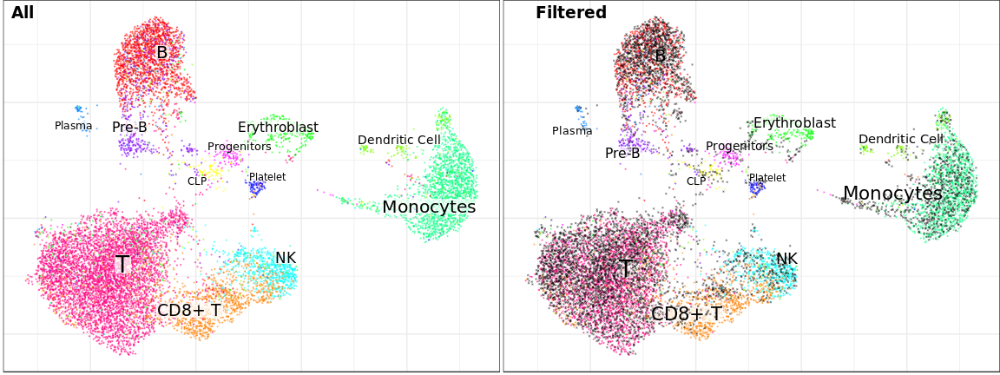
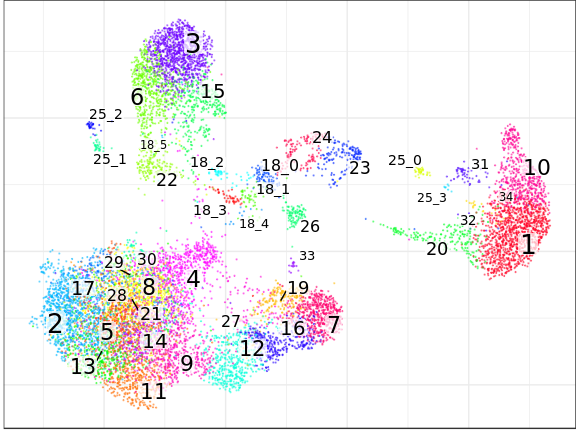
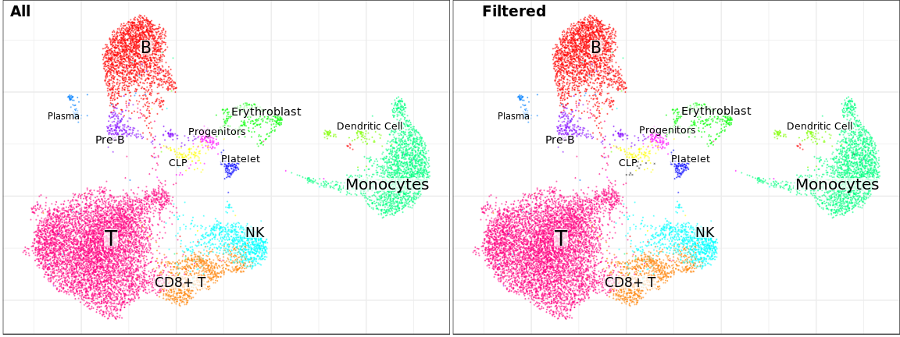

Annotation of BM+CB data across multiple datasets with Conos
================

This vignette shows annotation of BM+CB dataset from the [Conos
tutorial](https://github.com/hms-dbmi/conos/blob/master/vignettes/walkthrough.md)
across multiple samples

``` r
library(CellAnnotatoR)
library(conos)
library(pagoda2)
library(dplyr)
library(ggplot2)
library(pbapply)
library(cowplot)

theme_set(theme_bw())
```

## Pre-processing

Let’s load and pre-process data:

``` r
panel <- readRDS(system.file("extdata", "panel.rds", package="conos"))
panel_preprocessed <- lapply(panel, basicP2proc, n.cores=4, min.cells.per.gene=0, 
                             n.odgenes=2e3, get.largevis=FALSE, make.geneknn=FALSE)
#> 3000 cells, 33694 genes; normalizing ... using plain model winsorizing ... log scale ... done.
#> calculating variance fit ... using gam 171 overdispersed genes ... 171persisting ... done.
#> running PCA using 2000 OD genes .... done
#> running tSNE using 4 cores:
#> 3000 cells, 33694 genes; normalizing ... using plain model winsorizing ... log scale ... done.
#> calculating variance fit ... using gam 159 overdispersed genes ... 159persisting ... done.
#> running PCA using 2000 OD genes .... done
#> running tSNE using 4 cores:
#> 3000 cells, 33694 genes; normalizing ... using plain model winsorizing ... log scale ... done.
#> calculating variance fit ... using gam 248 overdispersed genes ... 248persisting ... done.
#> running PCA using 2000 OD genes .... done
#> running tSNE using 4 cores:
#> 3000 cells, 33694 genes; normalizing ... using plain model winsorizing ... log scale ... done.
#> calculating variance fit ... using gam 166 overdispersed genes ... 166persisting ... done.
#> running PCA using 2000 OD genes .... done
#> running tSNE using 4 cores:
```

Now we can integrate it with Conos:

``` r
con <- Conos$new(panel_preprocessed, n.cores=4)
con$buildGraph()
#> found 0 out of 6 cached PCA  space pairs ... running 6 additional PCA  space pairs  done
#> inter-sample links using  mNN   done
#> local pairs local pairs  done
#> building graph ..done
con$findCommunities(method=conos::leiden.community, resolution=3)
con$embedGraph(method="UMAP", min.dist=1, spread=2, n.cores=30)
#> Convert graph to adjacency list...
#> Done
#> Estimate nearest neighbors and commute times...
#> Estimating hitting distances: 14:49:17.
#> Done.
#> Estimating commute distances: 14:49:19.
#> Hashing adjacency list: 14:49:19.
#> Done.
#> Estimating distances: 14:49:20.
#> Done
#> Done.
#> All done!: 14:49:22.
#> Done
#> Estimate UMAP embedding...
#> 14:49:22 UMAP embedding parameters a = 0.09172 b = 1.334
#> 14:49:22 Read 12000 rows and found 1 numeric columns
#> 14:49:22 Commencing smooth kNN distance calibration using 30 threads
#> 14:49:23 Initializing from normalized Laplacian + noise
#> 14:49:24 Commencing optimization for 1000 epochs, with 321062 positive edges using 30 threads
#> 14:49:31 Optimization finished
#> Done

con$plotGraph(size=0.2, shuffle.colors=T)
```

<!-- -->

Prepare data for
annotation:

``` r
marker_path <- system.file("extdata", "bm_cb.md", package = "CellAnnotatoR")
markers <- parseMarkerFile(marker_path) # We don't want to re-read marker inside each step of lapply
clf_datas <- lapply(con$samples, function(p2) 
  getClassificationData(Matrix::t(p2$misc$rawCounts), markers))

score_infos <- lapply(clf_datas, getMarkerScoreInfo)
```

## Annotation

Now we can run individual annotation on each dataset:

``` r
ann_by_dataset <- pbmapply(function(cd, ms, p2) 
  assignCellsByScores(p2$graphs$PCA, score.info=ms, clf.data=cd),
  clf_datas, score_infos, panel_preprocessed, SIMPLIFY=F) %>% 
  setNames(names(clf_datas))

all_annotations <- lapply(ann_by_dataset, function(an) an$annotation$l1) %>% Reduce(c, .)
all_annotations_filt <- lapply(ann_by_dataset, function(an) an$annotation.filt$l1) %>% Reduce(c, .)

plot_grid(
  con$plotGraph(groups=all_annotations, size=0.2),
  con$plotGraph(groups=all_annotations_filt, size=0.2), 
  labels=c("All", "Filtered")
)
```

<!-- -->

We can see that running annotation on individual samples doesn’t
neccesserily guarantee smoothness of labeling on the joint graph, as
such approach can’t utilize joint structure. To deal with it we can run
annotation on the whole graph:

``` r
all_score_info <- mergeScoreInfos(score_infos, verbose=T)
ann_by_level <- assignCellsByScores(con$graph, score.info=all_score_info, clf.data=clf_datas[[1]])

plot_grid(
  con$plotGraph(groups=ann_by_level$annotation$l1, size=0.2),
  con$plotGraph(groups=ann_by_level$annotation.filt$l1, size=0.2), 
  labels=c("All", "Filtered")
)
```

<!-- -->

To further deal with noise, we can use clustering information:

``` r
clusters <- con$clusters$leiden$groups
ann_by_level <- assignCellsByScores(con$graph, score.info=all_score_info, clf.data=clf_datas[[1]], 
                                clusters=clusters)

plot_grid(
  con$plotGraph(groups=ann_by_level$annotation$l1, size=0.2),
  con$plotGraph(groups=ann_by_level$annotation.filt$l1, size=0.2), 
  labels=c("All", "Filtered")
)
```

<!-- -->

In the current example, clustering resolution is too low to separate all
subpopulatons, which lead to lack of CLP and DC populations. Let’s
increase resolution:

``` r
ann <- ann_by_level$annotation$l1
target_clusters <- clusters[names(ann)[ann %in% c("Progenitors", "Plasma")]] %>% 
  as.character() %>% unique()
clusters_inc <- findSubcommunities(con, target_clusters, groups=clusters, resolution=1)
con$plotGraph(groups=clusters_inc, size=0.2, shuffle.colors=T)
```

<!-- -->

And now we can re-run
annotation:

``` r
ann_by_level <- assignCellsByScores(con$graph, score.info=all_score_info, clf.data=clf_datas[[1]], 
                                clusters=clusters_inc)

plot_grid(
  con$plotGraph(groups=ann_by_level$annotation$l1, size=0.2),
  con$plotGraph(groups=ann_by_level$annotation.filt$l1, size=0.2), 
  labels=c("All", "Filtered")
)
```

<!-- -->
